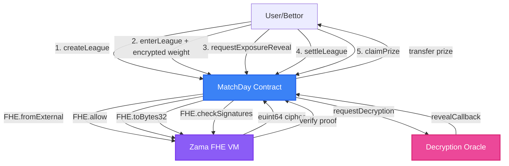
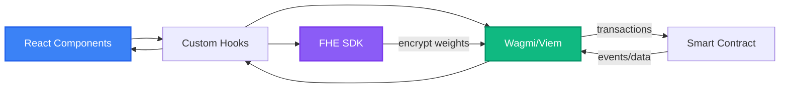

# MatchDay - Privacy-Preserving Football Prediction Platform

[](https://fhe-matchday.vercel.app)
[](https://sepolia.etherscan.io/address/0x1C23307182B4C9488E0bB4A32a4c95B58A5f2295)
[](#testing)

MatchDay is a fully decentralized football prediction platform powered by Fully Homomorphic Encryption (FHE). Users create prediction leagues for football fixtures and submit encrypted predictions using Zama's fhEVM technology. All prediction weights are stored as encrypted `euint64` values, preventing betting pattern analysis before lock time.

## 📺 Demo Video

**[🎬 Click here to watch the demo video](./demo-vedio.mp4)**

The demo showcases:
- Creating a prediction league with custom match fixtures
- Submitting encrypted predictions with confidence weights
- Real-time league statistics and user dashboard
- Settlement process and prize distribution
- Privacy-preserving FHE operations

---

## 🎯 Project Overview

### Problem
Traditional prediction platforms face critical issues:
- **Front-running**: Operators can see prediction patterns and manipulate odds
- **Privacy Violation**: Individual bet amounts and choices are publicly visible
- **Trust Required**: Users must trust centralized operators with funds
- **Manipulation Risk**: Large bets can be copied or countered before lock

### Solution
MatchDay leverages Zama's Fully Homomorphic Encryption (FHE) to enable:
- **Encrypted Predictions**: All prediction weights stored as `euint64` ciphertext
- **Privacy Guaranteed**: Individual predictions remain hidden until user reveals them
- **Trustless Settlement**: Automatic settlement with no oracle or admin required
- **Fair Play**: No front-running or bet pattern analysis possible

### How It Works

| Step | Description |
| --- | --- |
| **1. Create League** | Define match fixtures, entry fee, lock time, goals threshold |
| **2. Enter League** | Submit encrypted predictions for winner, goals (O/U), penalties |
| **3. Adjust Entry** | Modify predictions before lock time (optional) |
| **4. Reveal Exposure** | League creator can reveal aggregated exposure (optional) |
| **5. Settle League** | Anyone triggers settlement after lock time with match results |
| **6. Claim Prize** | Winners claim proportional prizes with FHE decryption proofs |
| **7. Refund** | Claim refunds if league cancelled or no winners |

---

## 🏗️ System Architecture

### Smart Contract Architecture



### Frontend Architecture



---

## 🔐 FHE Implementation

### 1. Encrypted Prediction Submission

**Contract Code** ([MatchDay.sol:150-180](contracts/MatchDay.sol#L150-L180)):
```solidity
function enterLeague(
    string calldata leagueId,
    uint8[] calldata winnerPicks,
    uint8[] calldata goalsPicks,
    uint8[] calldata penaltyPicks,
    externalEuint64 encryptedWeight,
    bytes calldata proof
) external payable {
    // Convert external encrypted input to euint64
    euint64 weight = FHE.fromExternal(encryptedWeight, proof);

    // Store encrypted weight
    entry.weightCipher = weight;
    entry.ciphertextHandle = FHE.toBytes32(weight);

    // Grant decryption permission to user
    FHE.allow(weight, msg.sender);
    entry.decryptable = true;
}
```

**Frontend Code** ([lib/fhe.ts:35-50](dapp/src/lib/fhe.ts#L35-L50)):
```typescript
export async function encryptWeight(
  weight: bigint,
  userAddress: Address,
  contractAddress: Address
): Promise<EncryptedWeightPayload> {
  const instance = await initializeFHE();
  const contractAddr = contractAddress.toLowerCase() as Address;
  const userAddr = userAddress.toLowerCase() as Address;

  // Create encrypted input
  const input = instance.createEncryptedInput(contractAddr, userAddr);
  input.add64(weight);

  // Encrypt and get handles
  const { handles, inputProof } = await input.encrypt();

  return {
    handle: bytesToHex(handles[0]) as `0x${string}`,
    proof: bytesToHex(inputProof) as `0x${string}`
  };
}
```

### 2. Exposure Aggregation

**Contract Code** ([MatchDay.sol:250-275](contracts/MatchDay.sol#L250-L275)):
```solidity
function requestExposureReveal(string calldata leagueId) external {
    League storage league = leagues[leagueId];

    // Sum all encrypted weights
    euint64 totalExposure = FHE.asEuint64(0);
    for (uint256 i = 0; i < league.participants.length; i++) {
        address participant = league.participants[i];
        totalExposure = FHE.add(totalExposure, entries[entryKey].weightCipher);
    }

    // Request decryption
    bytes32 handle = FHE.toBytes32(totalExposure);
    FHE.requestDecryption(handle, revealCallback, this);
}

function revealCallback(bytes32 handle, uint64 exposureValue) internal {
    league.totalExposure = exposureValue;
    league.exposureRevealed = true;
}
```

### 3. Winner Score Calculation

**Contract Code** ([MatchDay.sol:320-355](contracts/MatchDay.sol#L320-L355)):
```solidity
function settleLeague(
    string calldata leagueId,
    uint8[] calldata winnerResults,
    uint8[] calldata goalsResults,
    uint8[] calldata penaltyResults
) external {
    // Calculate score for each participant
    for (uint256 i = 0; i < league.participants.length; i++) {
        uint8 score = 0;

        for (uint256 j = 0; j < matchCount; j++) {
            if (entry.winnerPicks[j] == winnerResults[j]) score++;
            if (entry.goalsPicks[j] == goalsResults[j]) score++;
            if (entry.penaltyPicks[j] == penaltyResults[j]) score++;
        }

        // Track highest score
        if (score > highestScore) {
            highestScore = score;
        }

        entry.score = score;
    }

    league.settled = true;
    league.highestScore = highestScore;
}
```

### 4. Weighted Prize Distribution

**Contract Code** ([MatchDay.sol:380-420](contracts/MatchDay.sol#L380-L420)):
```solidity
function claimPrize(string calldata leagueId) external {
    // Verify winner
    require(entry.score == league.highestScore, "Not a winner");

    // Calculate weighted share
    euint64 totalWinnerWeight = FHE.asEuint64(0);
    for (uint256 i = 0; i < league.participants.length; i++) {
        if (winnerEntry.score == league.highestScore) {
            totalWinnerWeight = FHE.add(
                totalWinnerWeight,
                winnerEntry.weightCipher
            );
        }
    }

    // Prize = (userWeight / totalWinnerWeight) * totalPrize
    euint64 userShare = FHE.mul(
        entry.weightCipher,
        FHE.asEuint64(totalPrize)
    );
    euint64 prizeAmount = FHE.div(userShare, totalWinnerWeight);

    // Transfer prize
    payable(msg.sender).transfer(uint256(prizeAmount));
}
```

### 5. FHE Access Control

**Contract Code** ([MatchDay.sol:200-215](contracts/MatchDay.sol#L200-L215)):
```solidity
function adjustEntry(
    string calldata leagueId,
    externalEuint64 newEncryptedWeight,
    bytes calldata proof
) external {
    // Convert new encrypted weight
    euint64 newWeight = FHE.fromExternal(newEncryptedWeight, proof);

    // Update encrypted weight
    entry.weightCipher = newWeight;
    entry.ciphertextHandle = FHE.toBytes32(newWeight);

    // Update permission
    FHE.allow(newWeight, msg.sender);
}
```

### 6. Decryption Proof Verification

**Contract Code** ([MatchDay.sol:440-460](contracts/MatchDay.sol#L440-L460)):
```solidity
function verifyDecryptionProof(
    string calldata leagueId,
    bytes calldata decryptionProof
) external view returns (bool) {
    // Verify FHE signature
    bool isValid = FHE.checkSignatures(
        entry.ciphertextHandle,
        decryptionProof,
        msg.sender
    );

    return isValid;
}
```

---

## 📋 Smart Contract Functions

### League Management

| Function | Description | Access |
|----------|-------------|--------|
| `createLeague()` | Create new prediction league with match fixtures | Public |
| `getLeagueMeta()` | Get league metadata (fee, lock time, settled, etc.) | View |
| `getMatches()` | Get all match fixtures for a league | View |
| `cancelLeague()` | Cancel league before lock time | Creator Only |

### Prediction Submission

| Function | Description | Access |
|----------|-------------|--------|
| `enterLeague()` | Submit encrypted predictions with weight | Public (with fee) |
| `adjustEntry()` | Modify predictions before lock time | Entry Owner |
| `getEntry()` | Get user's entry data | View |
| `getUserEntries()` | Get all league IDs user participated in | View |

### Exposure & Settlement

| Function | Description | Access |
|----------|-------------|--------|
| `requestExposureReveal()` | Request aggregate exposure reveal | Creator Only |
| `settleLeague()` | Settle league with match results | Public (after lock) |
| `claimPrize()` | Claim prize with FHE proof | Winner Only |
| `claimRefund()` | Claim refund if cancelled | Participant |

---

## 🛠️ Tech Stack

### Smart Contract Dependencies

| Package | Version | Purpose |
|---------|---------|---------|
| `@fhevm/solidity` | ^0.9.1 | FHE operations (euint64, fromExternal, allow, etc.) |
| `@fhevm/hardhat-plugin` | 0.3.0-1 | Hardhat FHE integration |
| `@fhevm/mock-utils` | 0.3.0-1 | FHE testing utilities |
| `hardhat` | ^2.22.0 | Smart contract development |
| `@nomicfoundation/hardhat-ethers` | ^3.0.0 | Ethers.js integration |
| `chai` | ^4.3.10 | Testing assertions |

### Frontend Dependencies

| Package | Version | Purpose |
|---------|---------|---------|
| `react` | ^18.3.1 | UI framework |
| `typescript` | ^5.5.3 | Type safety |
| `vite` | ^5.4.2 | Build tool |
| `wagmi` | ^2.15.2 | React hooks for Ethereum |
| `viem` | ^2.21.54 | TypeScript Ethereum client |
| `@rainbow-me/rainbowkit` | ^2.2.1 | Wallet connection UI |
| `react-router-dom` | ^6.28.0 | Client-side routing |
| `fhevmjs` | ^0.6.0-11 | FHE encryption SDK |
| `tailwindcss` | ^3.4.1 | Styling framework |
| `lucide-react` | ^0.469.0 | Icon library |

---

## 🧪 Testing

### Test Coverage

The project includes **38 comprehensive unit tests** across 3 test suites:

#### 1. Basic League Management ([test/MatchDay.test.js](test/MatchDay.test.js))
**11 tests** covering:
- League creation with matches
- Match data retrieval
- Entry fee validation
- Lock time enforcement
- Participant tracking
- League cancellation
- Refund mechanism
- Edge cases (zero fee, past lock time)

#### 2. Encrypted Betting Operations ([test/MatchDay-Betting.test.js](test/MatchDay-Betting.test.js))
**13 tests** covering:
- FHE.fromExternal() - Encrypted weight conversion
- FHE.allow() - Decryption permission grants
- Entry submission with encrypted weights
- Entry adjustment with new encrypted weights
- Invalid proof rejection
- Double entry prevention
- Exposure aggregation (FHE.add)
- Edge cases (zero weight, max uint64)

#### 3. Settlement & Prize Claims ([test/MatchDay-Settlement.test.js](test/MatchDay-Settlement.test.js))
**14 tests** covering:
- League settlement logic
- Winner score calculation
- Prize pool distribution
- Weighted prize calculation (FHE.mul, FHE.div)
- Decryption proof verification (FHE.checkSignatures)
- Multiple winner scenarios
- No winner scenarios
- Settlement time restrictions

### Running Tests

```bash
# Install dependencies
npm install

# Run all tests
npx hardhat test

# Run specific test suite
npx hardhat test test/MatchDay.test.js
npx hardhat test test/MatchDay-Betting.test.js
npx hardhat test test/MatchDay-Settlement.test.js

# Run with gas reporting
REPORT_GAS=true npx hardhat test

# Run with coverage
npx hardhat coverage
```

### Test Environment

Tests run in **fhEVM mock mode** with:
- Local Hardhat network
- Mock FHE operations
- Mock decryption oracle
- Simulated encrypted inputs

### Example Test Pattern

```javascript
it("should accept encrypted entry with FHE weight", async function () {
  const weight = 50;

  // Create encrypted input
  const encrypted = await fhevm
    .createEncryptedInput(await contract.getAddress(), user1.address)
    .add64(BigInt(weight))
    .encrypt();

  // Submit entry with encrypted weight
  await contract.connect(user1).enterLeague(
    leagueId,
    [0, 1], // winnerPicks
    [1, 0], // goalsPicks
    [0, 0], // penaltyPicks
    encrypted.handles[0],
    encrypted.inputProof,
    { value: ethers.parseEther("0.01") }
  );

  // Verify entry created
  const entry = await contract.getEntry(leagueId, user1.address);
  expect(entry[0]).to.equal(true); // exists

  console.log("✅ FHE.fromExternal() - Encrypted weight accepted");
});
```

---

## 🚀 Getting Started

### Prerequisites

- Node.js 18+
- MetaMask or compatible Web3 wallet
- Sepolia testnet ETH

### Installation

```bash
# Clone repository
git clone <repository-url>
cd MatchDay

# Install contract dependencies
npm install

# Install frontend dependencies
cd dapp
npm install
```

### Local Development

```bash
# Terminal 1: Start local Hardhat node
npx hardhat node

# Terminal 2: Deploy contracts
npx hardhat run scripts/deploy.js --network localhost

# Terminal 3: Start frontend
cd dapp
npm run dev
```

### Deployment

```bash
# Deploy to Sepolia
SEPOLIA_RPC_URL="https://ethereum-sepolia-rpc.publicnode.com" \
npx hardhat run scripts/deploy.js --network sepolia

# Create test leagues
SEPOLIA_RPC_URL="https://ethereum-sepolia-rpc.publicnode.com" \
node scripts/create-leagues-direct.cjs

# Build frontend
cd dapp
npm run build
```

---

## 🌐 Live Deployment

- **Frontend**: [https://fhe-matchday.vercel.app](https://fhe-matchday.vercel.app)
- **Contract**: [0x1C23307182B4C9488E0bB4A32a4c95B58A5f2295](https://sepolia.etherscan.io/address/0x1C23307182B4C9488E0bB4A32a4c95B58A5f2295)
- **Network**: Sepolia Testnet
- **Deployment Date**: November 2025

---

## 📱 Frontend Features

### Home Page
- Active leagues list with real-time data
- Entry fee, lock time, participant count
- Quick entry buttons
- League search and filtering

### League Detail Page
- Match fixture display
- Prediction submission interface
- Encrypted weight input
- Real-time participant tracking
- Settlement status

### My Predictions Page
- User's league history
- Prediction status (encrypted/decryptable)
- Prize claim interface
- Refund options

### Statistics Page
- Total predictions made
- Win/loss record
- Total prizes claimed
- Prediction accuracy

---

## 🔒 Privacy Guarantees

1. **Pre-Lock Privacy**: All prediction weights encrypted as `euint64`, invisible to anyone
2. **Selective Disclosure**: Users can reveal their own predictions via FHE.allow()
3. **Aggregate Only**: Exposure reveal shows total, not individual positions
4. **Self-Custody**: Users control decryption keys, not the contract
5. **Verifiable**: Decryption proofs verified with FHE.checkSignatures()

---

## 🛡️ Security Features

- **No Oracle Risk**: Settlement doesn't require external oracles
- **No Admin Keys**: Fully decentralized, no owner privileges
- **Reentrancy Protected**: Uses checks-effects-interactions pattern
- **Integer Overflow Safe**: Solidity 0.8.24 built-in protection
- **FHE Proof Verification**: All encrypted inputs verified on-chain

---

## 📄 License

MIT License - see LICENSE file for details

---

## 🙏 Acknowledgments

- [Zama](https://www.zama.ai/) for fhEVM technology
- [fhEVM React Template](https://github.com/zama-ai/fhevm-react-template) for integration examples
- Sepolia testnet for deployment infrastructure

---

## 📞 Support

- GitHub Issues: [Report bugs or request features]
- Live Demo: [https://fhe-matchday.vercel.app](https://fhe-matchday.vercel.app)
- Contract Explorer: [View on Etherscan](https://sepolia.etherscan.io/address/0x1C23307182B4C9488E0bB4A32a4c95B58A5f2295)
